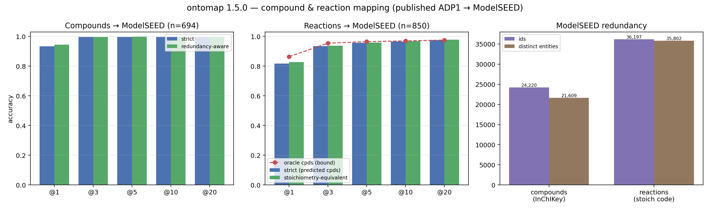
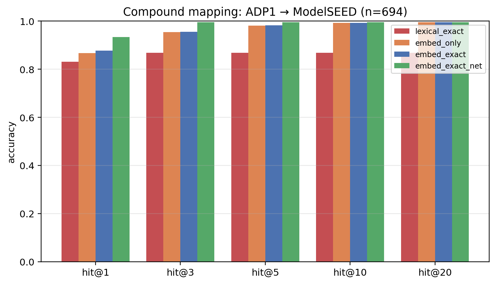
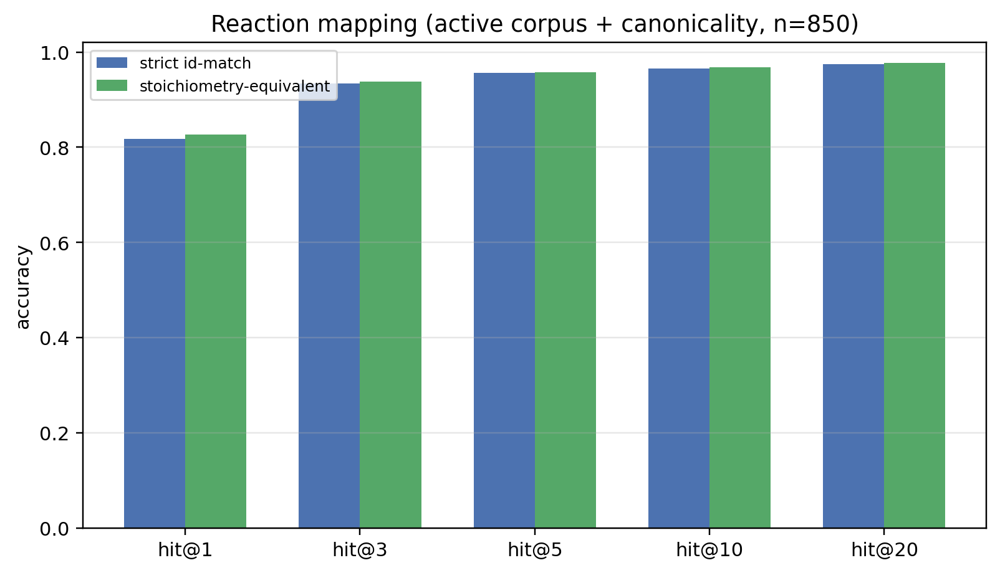
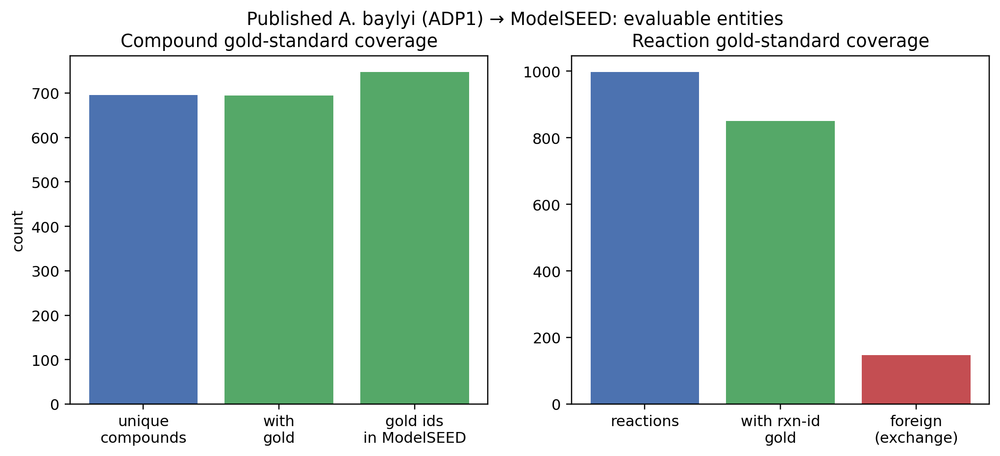
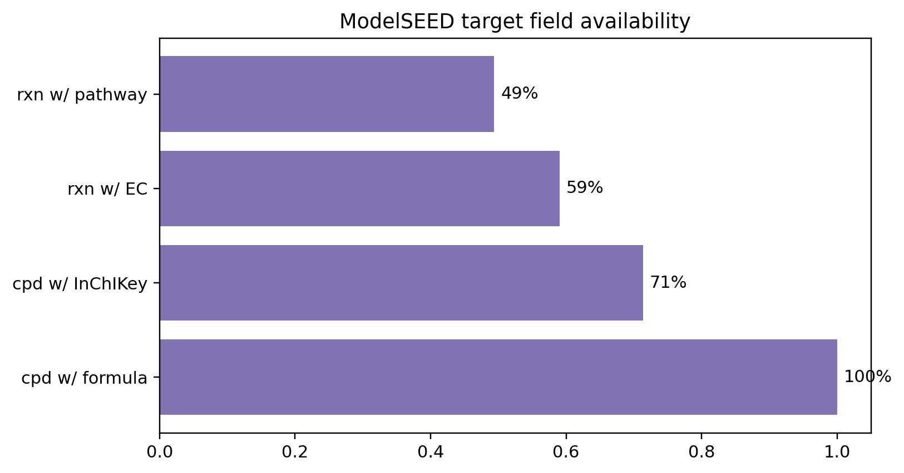
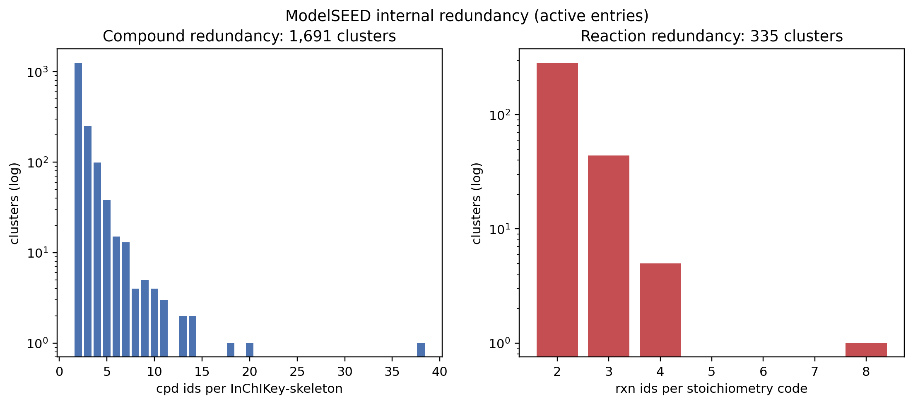
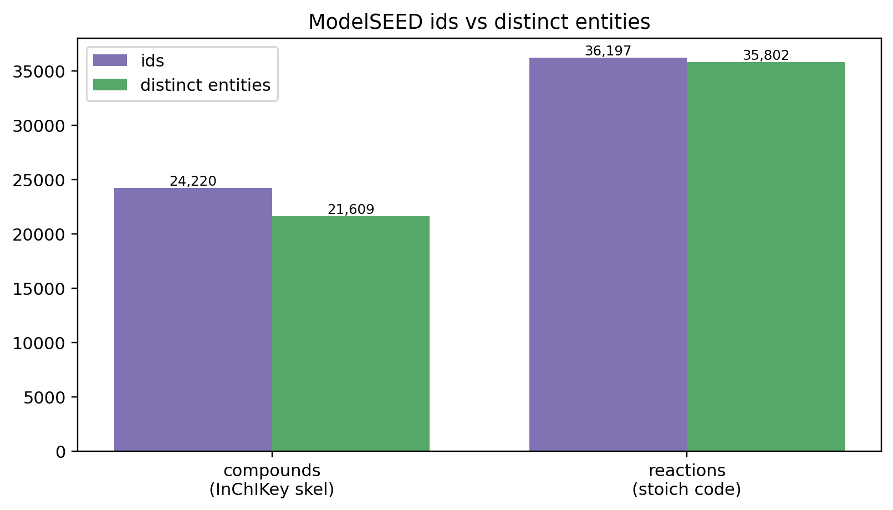

# Compound & Reaction Mapping (ontomap ≥ 1.5.0)

Map the **metabolites and reactions of an existing metabolic model** —
written in a foreign namespace — onto **ModelSEED** compound / reaction
ids. This is the second capability of ontomap, added *alongside* (not
replacing) the functional-annotation → reaction `Pipeline`:

| capability | input | target | module |
|------------|-------|--------|--------|
| annotation → reaction (1.x) | RAST/SSO/KO/free-text function | ModelSEED reactions | `ontomap.Pipeline` |
| **model → ModelSEED (1.5)** | a model's metabolites + reactions | ModelSEED compounds **and** reactions | `ontomap.modelmap` |

It answers the practical problem: *"I have a published model (e.g. an
A. baylyi / ADP1 reconstruction) whose ids don't match ModelSEED — line
every compound and reaction up with ModelSEED so I can integrate the
annotation."*

> **Validated** on the published `iAbaylyiv4` (*A. baylyi* ADP1) model
> against a held-out gold standard (Christopher Henry's translation),
> using **names + network structure only** (the embedded ModelSEED ids
> are never shown to the matcher). All numbers below are reproduced by an
> independent re-computation of the metrics from the raw prediction files.



---

## 1. Results at a glance

| task | n | hit@1 | hit@5 | hit@10 | MRR |
|------|---|-------|-------|--------|-----|
| **Compounds** (name + exact + network) | 694 | **0.934** | 0.996 | 0.996 | 0.963 |
| Compounds, redundancy-aware¹ | 694 | 0.944 | 0.997 | 0.997 | 0.969 |
| **Reactions** (name + compound-set, active corpus) | 850 | **0.818** | 0.956 | 0.966 | 0.879 |
| Reactions, stoichiometry-equivalent² | 850 | 0.827 | 0.958 | 0.968 | — |
| Reactions, oracle compounds (cascade bound) | 850 | 0.864 | 0.965 | 0.969 | 0.909 |

¹ a prediction counts if it is the *same molecule* as gold (identical
InChIKey-skeleton or formula+charge) — separates true error from
ModelSEED duplicate-id disagreement. formula+charge is loose (over-credits
isomers), so treat **0.934 (strict) and 0.944 (redundancy-aware) as a
lower/upper bracket**, not a point estimate.
² a prediction counts if it has the *same compound set* as gold.

95% bootstrap CIs: compound hit@1 **[0.915, 0.951]**; reaction hit@1
**[0.792, 0.845]**.




**Takeaways**
- Compound mapping is essentially solved at top-10 (99.6%). The
  reaction-network rerank is the key lift (**+5.6 pp** hit@1 over
  embedding+exact).
- Reaction mapping reaches **hit@1 0.82 / hit@10 0.97** from name +
  stoichiometry alone. The single biggest factor is restricting the
  target to **active** reactions (obsolete duplicates otherwise crush
  strict accuracy from 0.82 → 0.52).
- The compound→reaction **cascade is cheap**: using predicted vs gold
  compound mappings costs only ~4.6 pp.

### Which signals were actually evaluated (be precise)

Christopher Henry's spec lists name + db-refs + formula/charge + EC +
pathways + compounds as evidence. On *this* model only some are present on
the query side; the rest are implemented in `modelmap` but could not be
*scored* here (the table is the honest coverage map):

| signal | compounds | reactions |
|--------|-----------|-----------|
| name / synonyms | ✅ used & scored | ✅ used & scored |
| reaction-network context | ✅ used & scored | — |
| compound set (stoichiometry) | — | ✅ used & scored (via the compound mapping) |
| db cross-refs (KEGG/BiGG/…) | ⚙️ implemented, **absent on this model** (only ref = the answer) | ⚙️ implemented, absent |
| formula / charge / InChIKey | ⚙️ implemented, **absent on query side** (exercised on redundancy) | n/a |
| EC numbers | n/a | ⚙️ implemented, **absent on query side** |
| pathways | (inherited via network) | ⚙️ implemented, absent on query side |

So the headline numbers validate the **name + network (compounds)** and
**name + compound-set (reactions)** routes. The db-ref / EC / structural
routes are coded and ready but await a model that exposes those fields.

### Validation against the translated model

The gold above is the published model's embedded `annotation.ModelSEED`.
Henry also supplied a fully-translated model; we confirmed the two are
equivalent and scored against the translation directly:
- metabolite names are **identical index-for-index** (0 mismatches);
- the embedded annotation and the translated-model id **agree on 97.6%**
  of compounds (the ~2.4% gap = the curator's imperfect translation);
- scoring compound predictions **against the translated-model ids** gives
  **hit@1 = 0.897, hit@10 = 0.996** (vs 0.934 / 0.996 against the
  annotation) — the small hit@1 gap is exactly the two silver golds
  disagreeing, not a matcher change.

### Abstention (open gap)

`hit@k` assumes the answer is in ModelSEED. For the 147 foreign
`EXF_`/biomass/transport reactions (no ModelSEED equivalent) a deployed
mapper should *abstain*. The raw top-1 score separates in-DB (median 3.25)
from out-of-DB (median 2.90) **only weakly**: at a threshold retaining 90%
of gold, just **11%** of foreign reactions are abstained. Calibrated
confidence / margin-based abstention is recommended future work — the raw
score alone is not a reliable out-of-DB detector.

---

## 2. Inputs and outputs

### Inputs
- **A model** — a COBRA-style JSON `dict` with `metabolites`
  (`{id, name, ...}`) and `reactions` (`{id, name, metabolites:{met_id:coef}}`).
- **The ModelSEED database** — `compounds.tsv` + `reactions.tsv`
  (point `modelseed_dir` at your local copy of the ModelSEEDDatabase
  `Biochemistry/` tables).
- **Bundled weights** — SapBERT (`weights/sapbert`) is shipped with
  ontomap; no download needed.

### Outputs
`map_model(...)` returns:
```python
{
  "compounds": { local_metabolite_id: [(modelseed_cpd_id, score, signals), ...] },
  "reactions": { local_reaction_id:   [(modelseed_rxn_id, score, signals), ...] },
}
```
`signals` exposes *why* a candidate ranked where it did
(`emb`, `exact`, `net` for compounds; `name`, `set_jac`, `exact_set` for
reactions), so a curator can triage low-confidence calls.

---

## 3. How it works

**Compounds** — SapBERT multi-synonym embedding (every ModelSEED name +
alias is a vector; a query retrieves its nearest synonym) ∪ an exact
normalized-synonym index (high precision) → fused, then an optional
**reaction-network consistency rerank**: a candidate is boosted when the
ModelSEED compounds it co-occurs with match the (predicted) ModelSEED
mappings of the query compound's network neighbours. This operationalizes
"pathways/reactions inherited from reactions."

**Reactions** — a SapBERT reaction-name embedding (FAISS top-100) ∪ a
**stoichiometric compound-set** candidate generator (reactions sharing ≥2
mapped compounds), scored by
`w_name·name_similarity + w_set·(core_Jaccard + ½·exact_set)`, where the
query's compound set is produced by the CompoundMapper above. Cofactor-
ubiquitous compounds (H₂O, H⁺, ATP, NAD(P), CoA, CO₂, Pᵢ…) are excluded
from the overlap. Target = **active** ModelSEED reactions; a canonicality
prior prefers status-`OK` entries.

This reuses the same encoder family as the reaction `Pipeline`
(SapBERT/MedCPT, bundled). Note: the MedCPT cross-encoder **helps
reactions in the annotation pipeline but hurts here** as a name-only
reranker (compound hit@1 0.93 → 0.40; reaction −3.6 pp) — it is therefore
*not* used in `modelmap`.

---

## 4. Data & limitations (read before trusting the numbers)

These numbers come from one model (ADP1) against a curator-supplied
("silver") gold standard. Specifics:

1. **The gold is embedded in the query and the only cross-ref is the
   answer.** The published metabolites' only DB reference is
   `annotation.ModelSEED` (= the gold id) and 850/997 reaction ids are
   already ModelSEED ids. These are **held out**; the matcher sees only
   names (+ network). On a *real* foreign model the cross-refs would be
   KEGG/BiGG/MetaCyc and would resolve by exact alias lookup first — that
   path exists in the code but **cannot be scored on this model** because
   such refs are absent.
2. **Query compounds carry only names** (no formula/charge/SMILES), so
   structural verification cannot be applied to the ADP1 compound task.
   It is implemented and exercised on the redundancy task instead.
3. **Query reactions carry name + foreign stoichiometry only** (no EC /
   pathways), so reaction matching depends on name + the compound set
   (itself produced by the compound matcher — a measured cascade).
4. **The gold is "silver".** The curator notes *"my mapping isn't
   perfect."* Some annotations are loose/ambiguous (55 compounds carry
   >1 ModelSEED id), which **caps the measurable ceiling** — a matcher
   disagreement is not always a matcher error.
5. **Residual error *appears* to approach the gold/redundancy ceiling
   (hypothesis, not a measurement).** Most remaining compound misses are
   ModelSEED duplicate ids or tight chemical families (acyl-ACP chain
   length, charged tRNAs) at rank 2–3; most reaction misses are name
   divergences ("succinate dehydrogenase" vs gold "fumarate reductase
   complex") or empty-named gold reactions. We have not re-annotated the
   misses against an independent source, so with silver gold the true
   ceiling is unproven — strict hit@k is a *lower bound* on semantic
   correctness.
6. **Excluded:** 3 metabolites with no annotation; 147 foreign
   `EXF_*`/biomass/transport reactions with no ModelSEED equivalent
   (a deployed mapper should *abstain* on these).




---

## 5. ModelSEED internal redundancy (diagnostic)

Running ModelSEED against itself quantifies the redundancy that surfaces
as apparent mapping "errors":

- **Compounds**: of 24,220 active compounds with an InChIKey, only 21,609
  distinct 2D-skeletons — **1,691 duplicate-structure clusters, 2,611
  redundant ids (10.8%)**, largest cluster 38. Even ATP, NAD, NADH,
  NADPH, NADP have ≥2 active ids. SapBERT finds a further ~2,457
  name-near-duplicate pairs the structural keys miss (Heme/Hemes,
  Glycine/L-glycine, stereo, plurals).
- **Reactions**: 36,197 active → 35,802 distinct stoichiometry codes —
  **335 exact-duplicate clusters (1.09%)**; most reaction redundancy
  lives in the *obsolete* space.




Reusable de-duplication maps (one canonical id per cluster) are produced
for both compounds and reactions.

---

## 6. Usage

```python
from ontomap import CompoundMapper, ReactionMapper, map_model
import json

# one compound
cm = CompoundMapper.from_modelseed("data/raw/modelseed").build()
cm.map("pimelate")[0]            # -> ('cpd01727', 2.0, {'emb':1.0,'exact':1})

# a whole model in one call (compounds first, then reactions using them)
model = json.load(open("PublishedModel.json"))
out = map_model(model, modelseed_dir="data/raw/modelseed")   # top_k=100 per query (default)
out["compounds"]["CPD_DASH_205_Cytosol"][0]   # best ModelSEED cpd id
out["reactions"]["rxn12357_c0"][0]            # best ModelSEED rxn id
```

See `examples/06_map_published_model.py` for an end-to-end run that also
writes a per-entity TSV with confidence signals.

### Rich SQLite export (shareable, self-contained)
```python
from ontomap import map_model_to_sqlite     # ontomap >= 1.5.2
map_model_to_sqlite(model_json, path="adp1_modelseed_mapping.sqlite")   # top-100 per query (default)
```
Writes 8 tables (`compound_queries`/`compound_predictions`/`compound_targets`,
`reaction_queries`/`reaction_predictions`/`reaction_targets`, `performance`,
`run_metadata`) + 2 join views (`compound_top_n`, `reaction_top_n`). ModelSEED
target metadata is denormalized so the DB needs no external files. A
benchmarked, gold-scored DB for the ADP1 model (with a README reporting
RAM/query, queries/sec, and runtime) ships at
`workspace/49_compound_reaction_mapping_sqlite_deliver/data/output/`.

---

## 7. Provenance

Full study: `workspace/44–48_compound_reaction_mapping_*` in the research
workspace (data prep + gold, compound matcher, reaction matcher,
redundancy, synthesis). Methods, per-step conclusions, ablation tables,
failure analyses, and the de-duplication maps live there. The validated
core is promoted verbatim into `ontomap/ontomap/modelmap.py`.
